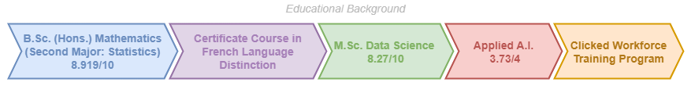

# Profile Summary
Data Scientist with a passion for turning data into insights. Skilled in Python, SQL and Cloud Computing (Microsoft Azure, Microsoft Fabric, GCP, AWS, Snowflake, Databricks and Salesforce). Proven collaborator with a drive for innovation. Ready to tackle challenging projects and deliver impactful results!

# My Journey

## ABOUT ME
I am a highly motivated and progress-focused Data Scientist with an impressive background in this industry. With a track record of initiative and dependability, I have devised strategic initiatives that I believe will prove valuable to my workplace. Having a Master's Degree in Data Science and a Bachelor's Degree with double majors in Mathematics & Statistics, I am well-equipped with theoretical concepts involved for detailed analysis. In my previous roles, I have contributed to decision-making, innovation and statistical model development along with team efforts and business improvements.

I am progressive-minded and in tune with new developments in AI. I have proven to be effective and collaborative with strong problem-solving abilities. In my studies as well as professional experience, I enjoyed collective brainstorming sessions which led me to coordinate activities to achieve a common vision and am well versed in technologies to deal with structured and unstructured data sources for analysis and processing. Honestly, most of my achievements are there in the resume but my passion towards my work can not be described in words. I have found something which is not letting me sleep overnight! I take responsibility for my actions every single time and stand on behalf of my team when needed. Please feel free to reach out if you think we can work together on something interesting.

[Featured Blog](https://blogs.sas.com/content/sascom/2024/06/17/how-to-command-a-room-with-data-when-your-audience-isnt-data-scientists/)

## WORK HISTORY

| Position                                                     | Company                                                | Duration            | Objective                                                                                                                   |
|--------------------------------------------------------------|--------------------------------------------------------|---------------------|-----------------------------------------------------------------------------------------------------------------------------|
| Data Scientist                                               | Unifier AI                                             | Mar 2024 - Present  | Prepare high-quality textual data for training question-answering LLM on data topics & execute training pipeline.           |
| Business Intelligence Analyst & Student Chapters Coordinator | BACG (Business Analytics Consulting Group Canada Ltd.) | Aug 2024 - Present  | Grow industry collaboration hub via decision-making and initiate industry & student chapters for subscription-based models. |
| Data Management & Analytics                                  | PathtoCareer Inc.                                      | May 2024 - Aug 2024 | Enhance platform data and user engagement through targeted data analysis and data governance principles.                    |
| Corporate Venture Capital & Business Analytics               | HP Tech Ventures (Extern)                              | May 2024 - Jul 2024 | Evaluate market position, growth potential, and strategic fit for potential investments.                                    |
| Cashier                                                      | Williams-Sonoma Canada, Inc.                           | Nov 2023 - Dec 2023 | Process customer transactions efficiently and accurately for in-person and online purchases.                                |
| Data Science Engineer                                        | Zykrr Technologies Pvt. Ltd.                           | Dec 2022 - Aug 2023 | Build advanced NLP models for text analytics, sentiment detection, customer feedback insights & predictive metrics.         |
| Data Analytics                                               | Instrovate Technologies                                | Mar 2022 - Jun 2022 | Assist Mobility & Security team in driving CI/CD pipeline & release workflow for optimal deployments.                       |
| Data Science & Business Analytics                            | The Sparks Foundation                                  | Apr 2022 - May 2022 | Tune a predictive time series model using product recommendations and create storytelling dashboards for clients.           |
| Data Scientist                                               | LetsGrowMore                                           | Sep 2021 - Oct 2021 | Train machine learning algorithms from scratch and improve performance by tuning model thresholds using scikit-learn.       |
| Content Team Lead                                            | Rehabilitation Society of the Visually Impaired        | Jun 2021 - Oct 2021 | Manage and coordinate content creation and delivery for the visually impaired.                                              |
| Content Platform Head                                        | Metvy                                                  | Jun 2021 - Oct 2021 | Oversee content strategy and execution for branding team's social media handles (LinkedIn and Quora).                       |
| Operations                                                   | Blue-Leaves Community                                  | Jul 2021 - Oct 2021 | Contribute to day-to-day operations and activities for upcoming events.                                                     |
| Graphic Designing                                            | Hello Study Global                                     | Jun 2021 - Sep 2021 | Create visual designs for Hello Study Global's marketing and communication materials.                                       |
| Human Resources                                              | BrainWeave                                             | Jun 2021 - Aug 2021 | Support HR functions such as recruitment, onboarding, employee engagement, and offboarding.                                 |
| Graphic Designing                                            | iProledge                                              | Jun 2021 - Jul 2021 | Design graphics for financial products and services (certifications).                                                       |
| Social Media Marketing                                       | Dewrty Foundation                                      | May 2021 - Jul 2021 | Manage social media presence and execute marketing campaigns via posters for awareness.                                     |
| Data Research Analysis Team Lead                             | Ace Overseas Education Consultants                     | Apr 2021 – Jul 2021 | Lead a 20-member content team boosting productivity by 20% via project coordination & ongoing support.                      |
| Graphic Designing                                            | CollegeTips.in                                         | May 2021 - Jun 2021 | Create visual designs for promoting website and marketing materials.                                                        |

PUBLICATION: [Virtual Reality and its Applications](http://www.sumc.lt/index.php/se/article/view/1546) This paper intends to focus on the use of virtual reality in education. The paper presents an innovative perspective on VR, offering a comprehensive overview of its basic facts and features. It delves into the specific applications of VR in educational settings, emphasizing its potential impact on teaching and learning.

## ACADEMICS

# Work Samples

| Project Name          | Description                                   | Technologies Used             | GitHub Repository                                          |
|-----------------------|-----------------------------------------------|-------------------------------|------------------------------------------------------------|
| Heart Failure Predictor   | Predicts heart failure using machine learning.  | Python, Machine Learning, Data Analysis  | [https://github.com/rashika-dabas/Heart-Failure-Predictor](https://github.com/rashika-dabas/Heart-Failure-Predictor) |
| Medium Article Scraper    | Scrapes articles from Medium.                 | Python, Web Scraping            | [https://github.com/rashika-dabas/Medium-Article-Scraper](https://github.com/rashika-dabas/Medium-Article-Scraper)   |
| AI Detector             | Detects AI-generated text.                    | Python, NLP, Machine Learning   | [https://github.com/rashika-dabas/AI-Detector](https://github.com/rashika-dabas/AI-Detector)                 |
| CinePulse               | Movie recommendation system.                  | Python, Data Analysis, ML      | [https://github.com/rashika-dabas/CinePulse](https://github.com/rashika-dabas/CinePulse)                   |
| VR Audio Description    | Audio description for VR environments.        | Python, NLP, Accessibility    | [https://github.com/rashika-dabas/VR-Audio-Description](https://github.com/rashika-dabas/VR-Audio-Description)   |
| AI Ethics               | Explores ethical considerations in AI.        | Python, Ethics, AI             | [https://github.com/rashika-dabas/AI-Ethics](https://github.com/rashika-dabas/AI-Ethics)                   |
| Amazon Crawling         | Web crawler for Amazon product data.          | Python, Web Scraping            | [https://github.com/rashika-dabas/Amazon-Crawling](https://github.com/rashika-dabas/Amazon-Crawling)         |
| Web Authenticator       | Web authentication system.                    | Python, Security, Web Dev      | [https://github.com/rashika-dabas/Web-Authenticator](https://github.com/rashika-dabas/Web-Authenticator)       |
| Student Placement App   | Application for student placement tracking.   | Python, Web Dev, Database      | [https://github.com/rashika-dabas/Student-Placement-App](https://github.com/rashika-dabas/Student-Placement-App)   |
| ChatbotRashi            | Chatbot development project.                  | Python, NLP, Chatbots           | [https://github.com/rashika-dabas/ChatbotRashi](https://github.com/rashika-dabas/ChatbotRashi)            |
| Login GUI               | Graphical user interface for login.           | Python, GUI Development        | [https://github.com/rashika-dabas/LoginGUI](https://github.com/rashika-dabas/LoginGUI)               |
| News Reader             | News aggregation and reading application.       | Python, Web Scraping, Data Analysis| [https://github.com/rashika-dabas/NewsReader](https://github.com/rashika-dabas/NewsReader)             |
| Movie Recommendation System| Recommends movies based on user preferences.  | Python, ML, Recommendation Systems | [https://github.com/rashika-dabas/Movie-Recommendation-System](https://github.com/rashika-dabas/Movie-Recommendation-System) |
| WhatsApper              | Automates sending WhatsApp messages.          | Python, Automation             | [https://github.com/rashika-dabas/WhatsApper](https://github.com/rashika-dabas/WhatsApper)              | 

## PROJECT OVERVIEWS
Overview covers 1 paragraph description and subject areas

## COMING SOON!
Projects not documented

# Contact Me
Linkedin: [https://www.linkedin.com/in/rashika-dabas/](https://www.linkedin.com/in/rashika-dabas/)  
Email: rashikadabas2000@gmail.com  
